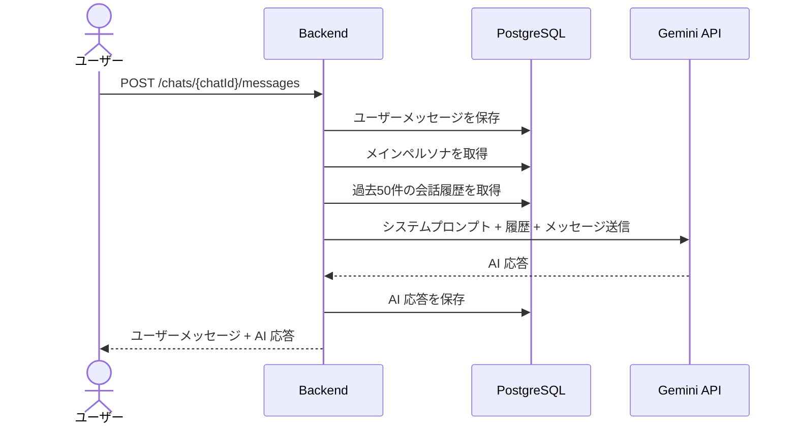
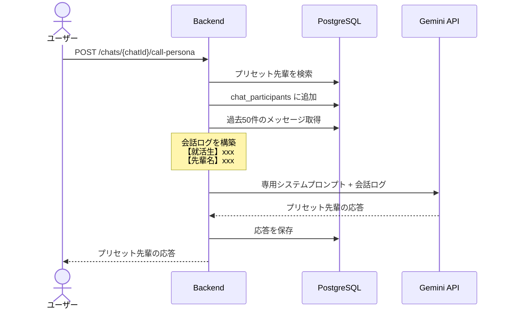

# AI ペルソナ設計

## 概要

wAI では「AI 先輩」というペルソナを通じて、就活生と AI が会話する。ペルソナには **カスタム先輩** と **プリセット先輩** の 2 種類がある。

## ペルソナの種類

### カスタム先輩（custom）

ユーザーがチャット作成時に自分で設定する先輩。

**設定項目**:

| 項目 | 必須 | 例 |
|------|------|-----|
| 名前 | ○ | 田中太郎 |
| 性別 | ○ | male / female / other |
| 年齢 | ○ | 25 |
| 職業 | ○ | エンジニア |
| 年収（万円） | ○ | 500 |
| システムプロンプト | × | 追加の性格設定等 |

チャット作成時にペルソナが自動生成され、そのチャット専用の先輩として会話に参加する。

### プリセット先輩（preset）

システムに事前登録された先輩。チャットの途中で呼び出せる。

| preset_key | ラベル | 特徴 |
|-----------|--------|------|
| `yarigai` | やりがい重視 | やりがいや自己実現を重視するアドバイスをする先輩 |
| `nenshu` | 年収重視 | 年収やキャリアアップを重視するアドバイスをする先輩 |

プリセット先輩はサーバー起動時に DB に自動登録される。

## AI との会話フロー

### 通常のメッセージ送信



### プリセット先輩の呼び出し



## システムプロンプトの構造

### カスタム先輩の場合

```
あなたは {name} という名前の先輩です。
年齢: {age}歳
性別: {gender}
職業: {occupation}
年収: {annual_income}万円

{custom system_prompt（設定時のみ）}
```

### プリセット先輩（途中参加）の場合

```
{プリセット先輩の base system_prompt}

あなたは別の先輩として途中から会話に参加します。
これまでの会話ログ:
---
【就活生】こんにちは
【田中太郎】こんにちは！就活について...
---
```

## グループチャットの仕組み

1 つのチャットに複数のペルソナが参加できる:

- **メインペルソナ**: チャット作成時のカスタム先輩（通常のメッセージに応答）
- **参加ペルソナ**: `call-persona` で呼び出されたプリセット先輩

各メッセージには `sender_type`（user / persona）と `persona_id` が紐づくため、誰の発言かを区別できる。
