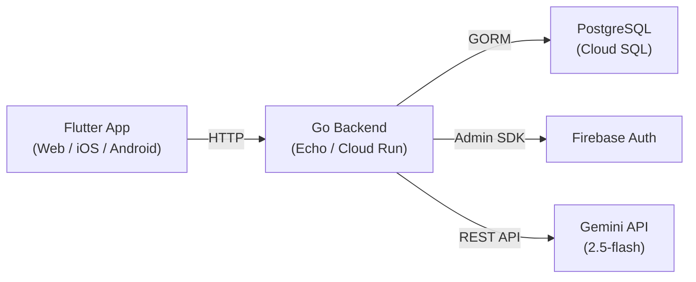

# アーキテクチャ設計書

## システム全体構成



## バックエンドレイヤー構成

handler → usecase → repository の 3 層アーキテクチャを採用。

```
cmd/server/main.go          … エントリーポイント
internal/
├── api/openapi.gen.go       … OpenAPI から自動生成されたルーティング・型定義
├── handler/                 … HTTP リクエスト/レスポンスの処理
│   ├── server_handler.go    … 全ハンドラーを束ねる ServerHandler
│   ├── login_handler.go     … 認証
│   ├── chat_handler.go      … チャット CRUD
│   ├── message_handler.go   … メッセージ送受信・先輩呼び出し
│   └── health_handler.go    … ヘルスチェック
├── usecase/                 … ビジネスロジック
│   ├── login_usecase.go     … ログイン・ユーザー自動登録
│   ├── chat_usecase.go      … チャット作成・一覧
│   └── message_usecase.go   … メッセージ送信・AI 応答・先輩呼び出し
├── repository/              … DB・外部サービスとのやりとり
│   ├── user_repository.go
│   ├── auth_repository.go   … Firebase Auth
│   ├── chat_repository.go
│   ├── message_repository.go
│   ├── persona_repository.go
│   ├── chat_participant_repository.go
│   └── gemini.go            … Gemini API クライアント
└── domain/
    ├── model/               … ドメインモデル（User, Chat, Message, Persona 等）
    └── config/config.go     … 環境変数の読み込み
registry/
├── wire.go                  … Wire DI 定義
├── wire_gen.go              … Wire 自動生成コード
└── providers.go             … DB, Firebase, Gemini のプロバイダー
```

## フロントエンド構成

Flutter + Riverpod によるフィーチャーベースの構成。

```
lib/src/
├── features/
│   ├── authentication/      … Google ログイン（Firebase Auth）
│   ├── chat/                … チャット一覧・メッセージ画面
│   ├── mentor/              … AI 先輩作成フォーム
│   └── dashboard/           … 自己分析ダッシュボード
├── common_widgets/          … 共通 UI コンポーネント
├── constants/               … テーマ・色・スペーシング
├── router/                  … go_router によるルーティング
└── api_provider.dart        … API クライアント初期化
packages/
└── wai_api/                 … OpenAPI から自動生成された Dart API クライアント
```

## DI（依存性注入）

バックエンドは Google Wire を使用。初期化順序：

1. **Config** — 環境変数の読み込み
2. **Providers** — DB(GORM), Firebase Auth Client, Gemini Client の生成
3. **Repositories** — 各データアクセス層の初期化
4. **Usecases** — ビジネスロジック層の初期化
5. **Handler (ServerHandler)** — HTTP ハンドラーの組み立て

フロントエンドは Riverpod の Provider で DI を実現。

## 技術選定理由

| 技術 | 選定理由 |
|------|---------|
| Go + Echo | 軽量・高速な API サーバー、OpenAPI コード生成との親和性 |
| Flutter | Web / iOS / Android をワンソースで対応 |
| Riverpod | 型安全な状態管理、テスタビリティ |
| Wire | コンパイル時 DI でランタイムエラーを防止 |
| OpenAPI + oapi-codegen | API 仕様を Single Source of Truth として型安全なコード生成 |
| Firebase Auth | Google ログインの迅速な実装 |
| Gemini 2.5 Flash | 高速かつ低コストな LLM |
| Terraform | インフラの再現性・コード管理 |
