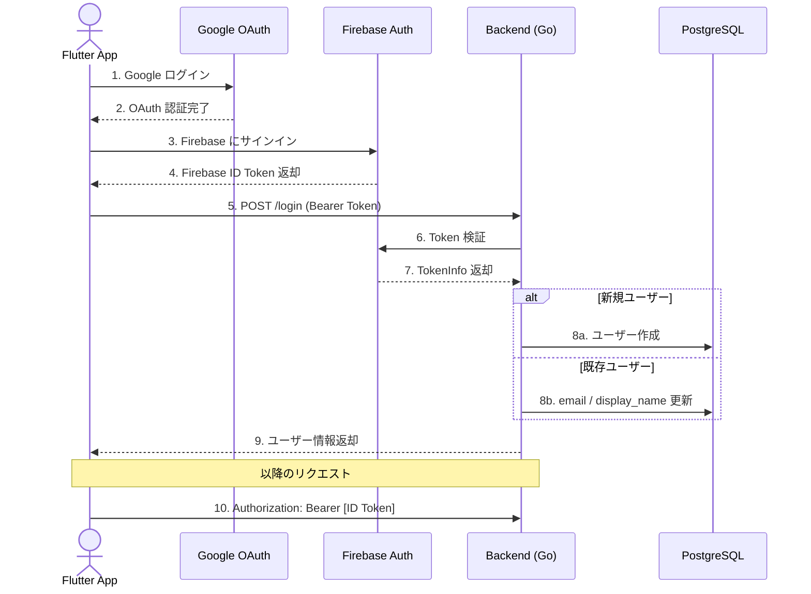

# 認証・認可フロー

## 概要

Firebase Authentication（Google ログイン）を使用したトークンベース認証。

## フロー図



## 詳細

### 1. フロントエンド（Flutter）

1. `google_sign_in` パッケージで Google OAuth 認証
2. `firebase_auth` で Firebase にサインイン
3. Firebase ID Token を取得
4. `POST /login` に Bearer Token として送信
5. 以降のすべての API リクエストに同じトークンを付与（`BearerAuthInterceptor`）

### 2. バックエンド（Go）

#### ログイン処理 (`POST /login`)

1. `Authorization` ヘッダーから Bearer Token を抽出
2. `AuthRepository.VerifyIDToken()` で Firebase Admin SDK を使いトークンを検証
3. Firebase UID でユーザーを検索
   - **新規**: ユーザーを自動作成（email, display_name を Firebase から取得）
   - **既存**: email, display_name を最新の値に更新
4. ユーザー情報を返却

#### 各エンドポイントの認証チェック

1. `authenticate(ctx)` メソッドで Bearer Token を検証
2. Firebase UID → DB の User を取得
3. 認証失敗時は `401 Unauthorized`

### 3. オプション: メールドメイン制限

環境変数 `ALLOWED_EMAIL_DOMAINS` にカンマ区切りでドメインを指定すると、そのドメインのメールアドレスを持つユーザーのみログイン可能。

```env
ALLOWED_EMAIL_DOMAINS=example.com,university.ac.jp
```
