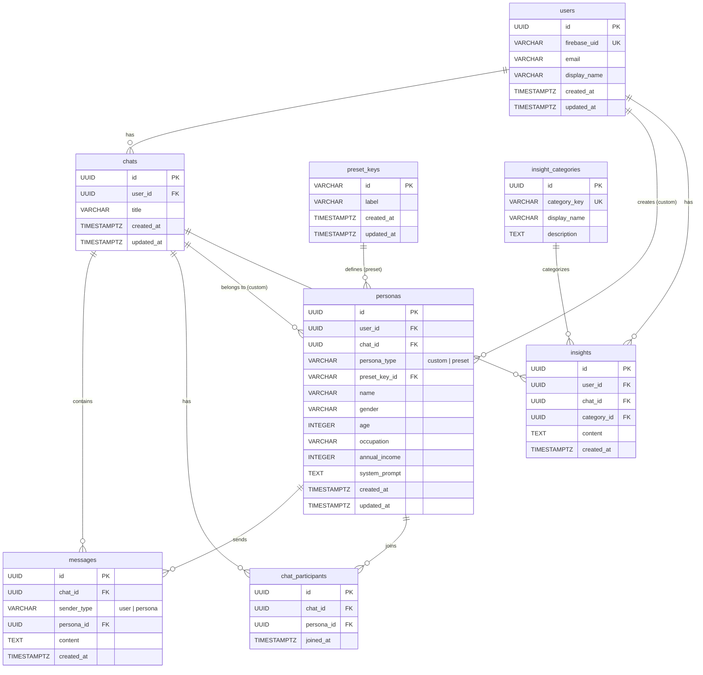

# DB 設計書

## 概要

- **DBMS**: PostgreSQL 16
- **ORM**: GORM（Go）
- **マイグレーション**: `backend/cmd/server/migrations/init.sql`
- **ERD 生成**: `make erd`（tbls）

## ER 図

## テーブル定義

### users

ユーザー情報。Firebase Auth と連携。

| カラム | 型 | 制約 | 説明 |
|--------|-----|------|------|
| id | UUID | PK, DEFAULT gen_random_uuid() | ユーザー ID |
| firebase_uid | VARCHAR(128) | NOT NULL, UNIQUE | Firebase UID |
| email | VARCHAR(255) | NOT NULL | メールアドレス |
| display_name | VARCHAR(255) | | 表示名 |
| created_at | TIMESTAMPTZ | NOT NULL, DEFAULT now() | 作成日時 |
| updated_at | TIMESTAMPTZ | NOT NULL, DEFAULT now() | 更新日時 |

### preset_keys

プリセット先輩のマスタデータ。

| カラム | 型 | 制約 | 説明 |
|--------|-----|------|------|
| id | VARCHAR(64) | PK | プリセットキー（例: yarigai, nenshu） |
| label | VARCHAR(128) | NOT NULL | 表示ラベル |
| created_at | TIMESTAMPTZ | NOT NULL, DEFAULT now() | 作成日時 |
| updated_at | TIMESTAMPTZ | NOT NULL, DEFAULT now() | 更新日時 |

### personas

AI 先輩の定義。カスタム先輩とプリセット先輩の両方を管理。

| カラム | 型 | 制約 | 説明 |
|--------|-----|------|------|
| id | UUID | PK, DEFAULT gen_random_uuid() | ペルソナ ID |
| user_id | UUID | FK → users(id), nullable | 作成者（カスタム時） |
| chat_id | UUID | FK → chats(id), nullable | 所属チャット（カスタム時） |
| persona_type | VARCHAR(16) | NOT NULL, CHECK (custom/preset) | 種別 |
| preset_key_id | VARCHAR(64) | FK → preset_keys(id), nullable | プリセットキー（プリセット時） |
| name | VARCHAR(128) | NOT NULL | 先輩の名前 |
| gender | VARCHAR(16) | | 性別 |
| age | INTEGER | | 年齢 |
| occupation | VARCHAR(128) | | 職業 |
| annual_income | INTEGER | | 年収（万円） |
| system_prompt | TEXT | | AI に渡すシステムプロンプト |
| created_at | TIMESTAMPTZ | NOT NULL, DEFAULT now() | 作成日時 |
| updated_at | TIMESTAMPTZ | NOT NULL, DEFAULT now() | 更新日時 |

**制約**:
- `custom` 型 → `user_id` が必須
- `preset` 型 → `preset_key_id` が必須

### chats

チャットセッション。

| カラム | 型 | 制約 | 説明 |
|--------|-----|------|------|
| id | UUID | PK, DEFAULT gen_random_uuid() | チャット ID |
| user_id | UUID | FK → users(id), NOT NULL | 所有ユーザー |
| title | VARCHAR(255) | NOT NULL, DEFAULT 'New Chat' | タイトル |
| created_at | TIMESTAMPTZ | NOT NULL, DEFAULT now() | 作成日時 |
| updated_at | TIMESTAMPTZ | NOT NULL, DEFAULT now() | 更新日時 |

### chat_participants

チャットに参加しているプリセット先輩を管理。

| カラム | 型 | 制約 | 説明 |
|--------|-----|------|------|
| id | UUID | PK, DEFAULT gen_random_uuid() | 参加 ID |
| chat_id | UUID | FK → chats(id), NOT NULL | チャット |
| persona_id | UUID | FK → personas(id), NOT NULL | 参加ペルソナ |
| joined_at | TIMESTAMPTZ | NOT NULL, DEFAULT now() | 参加日時 |

**制約**: `(chat_id, persona_id)` で UNIQUE

### messages

チャット内のメッセージ。

| カラム | 型 | 制約 | 説明 |
|--------|-----|------|------|
| id | UUID | PK, DEFAULT gen_random_uuid() | メッセージ ID |
| chat_id | UUID | FK → chats(id), NOT NULL | 所属チャット |
| sender_type | VARCHAR(16) | NOT NULL, CHECK (user/persona) | 送信者種別 |
| persona_id | UUID | FK → personas(id), nullable | 送信ペルソナ（persona 時） |
| content | TEXT | NOT NULL | メッセージ本文 |
| created_at | TIMESTAMPTZ | NOT NULL, DEFAULT now() | 送信日時 |

**制約**: `sender_type = 'persona'` の場合、`persona_id` が必須

### insight_categories

自己分析カテゴリのマスタ。

| カラム | 型 | 制約 | 説明 |
|--------|-----|------|------|
| id | UUID | PK, DEFAULT gen_random_uuid() | カテゴリ ID |
| category_key | VARCHAR(64) | NOT NULL, UNIQUE | カテゴリキー |
| display_name | VARCHAR(128) | NOT NULL | 表示名 |
| description | TEXT | | 説明 |

### insights

AI との会話から抽出された自己分析インサイト。

| カラム | 型 | 制約 | 説明 |
|--------|-----|------|------|
| id | UUID | PK, DEFAULT gen_random_uuid() | インサイト ID |
| user_id | UUID | FK → users(id), NOT NULL | ユーザー |
| chat_id | UUID | FK → chats(id), nullable | 元チャット |
| category_id | UUID | FK → insight_categories(id), NOT NULL | カテゴリ |
| content | TEXT | NOT NULL | インサイト内容 |
| created_at | TIMESTAMPTZ | NOT NULL, DEFAULT now() | 作成日時 |

## シードデータ

サーバー起動時に自動投入されるデータ:

| テーブル | データ |
|---------|--------|
| preset_keys | `yarigai`（やりがい重視）, `nenshu`（年収重視） |
| personas | 各プリセットキーに対応するプリセット先輩 2 名 |
