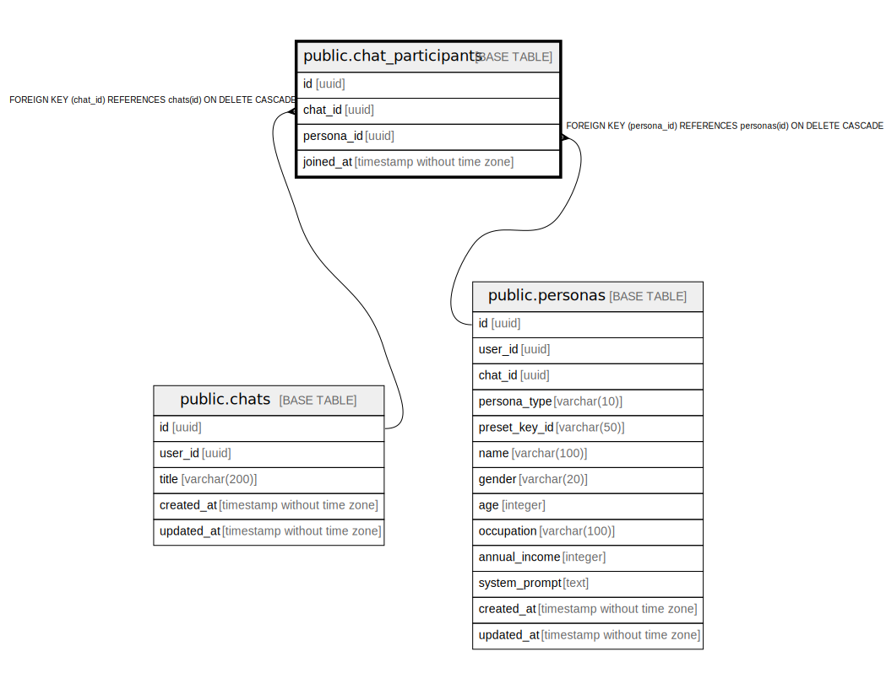

# public.chat_participants

## Description

## Columns

| Name | Type | Default | Nullable | Children | Parents | Comment |
| ---- | ---- | ------- | -------- | -------- | ------- | ------- |
| id | uuid | gen_random_uuid() | false |  |  |  |
| chat_id | uuid |  | false |  | [public.chats](public.chats.md) |  |
| persona_id | uuid |  | false |  | [public.personas](public.personas.md) |  |
| joined_at | timestamp without time zone | now() | false |  |  |  |

## Constraints

| Name | Type | Definition |
| ---- | ---- | ---------- |
| chat_participants_persona_id_fkey | FOREIGN KEY | FOREIGN KEY (persona_id) REFERENCES personas(id) ON DELETE CASCADE |
| chat_participants_chat_id_fkey | FOREIGN KEY | FOREIGN KEY (chat_id) REFERENCES chats(id) ON DELETE CASCADE |
| chat_participants_pkey | PRIMARY KEY | PRIMARY KEY (id) |
| chat_participants_chat_id_persona_id_key | UNIQUE | UNIQUE (chat_id, persona_id) |

## Indexes

| Name | Definition |
| ---- | ---------- |
| chat_participants_pkey | CREATE UNIQUE INDEX chat_participants_pkey ON public.chat_participants USING btree (id) |
| chat_participants_chat_id_persona_id_key | CREATE UNIQUE INDEX chat_participants_chat_id_persona_id_key ON public.chat_participants USING btree (chat_id, persona_id) |
| idx_chat_participants_chat | CREATE INDEX idx_chat_participants_chat ON public.chat_participants USING btree (chat_id) |

## Relations

---

> Generated by [tbls](https://github.com/k1LoW/tbls)
