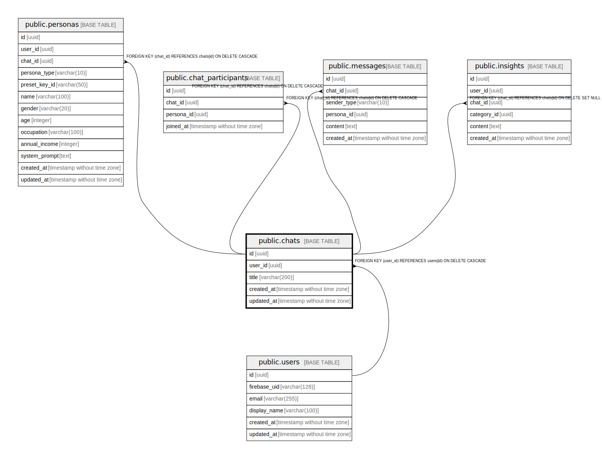

# public.chats

## Description

## Columns

| Name | Type | Default | Nullable | Children | Parents | Comment |
| ---- | ---- | ------- | -------- | -------- | ------- | ------- |
| id | uuid | gen_random_uuid() | false | [public.personas](public.personas.md) [public.chat_participants](public.chat_participants.md) [public.messages](public.messages.md) [public.insights](public.insights.md) |  |  |
| user_id | uuid |  | false |  | [public.users](public.users.md) |  |
| title | varchar(200) |  | true |  |  |  |
| created_at | timestamp without time zone | now() | false |  |  |  |
| updated_at | timestamp without time zone | now() | false |  |  |  |

## Constraints

| Name | Type | Definition |
| ---- | ---- | ---------- |
| chats_user_id_fkey | FOREIGN KEY | FOREIGN KEY (user_id) REFERENCES users(id) ON DELETE CASCADE |
| chats_pkey | PRIMARY KEY | PRIMARY KEY (id) |

## Indexes

| Name | Definition |
| ---- | ---------- |
| chats_pkey | CREATE UNIQUE INDEX chats_pkey ON public.chats USING btree (id) |
| idx_chats_user_id | CREATE INDEX idx_chats_user_id ON public.chats USING btree (user_id) |

## Relations

---

> Generated by [tbls](https://github.com/k1LoW/tbls)
