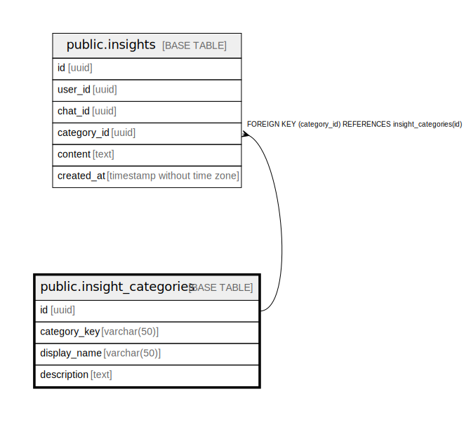

# public.insight_categories

## Description

## Columns

| Name | Type | Default | Nullable | Children | Parents | Comment |
| ---- | ---- | ------- | -------- | -------- | ------- | ------- |
| id | uuid | gen_random_uuid() | false | [public.insights](public.insights.md) |  |  |
| category_key | varchar(50) |  | false |  |  |  |
| display_name | varchar(50) |  | false |  |  |  |
| description | text |  | true |  |  |  |

## Constraints

| Name | Type | Definition |
| ---- | ---- | ---------- |
| insight_categories_pkey | PRIMARY KEY | PRIMARY KEY (id) |
| insight_categories_category_key_key | UNIQUE | UNIQUE (category_key) |

## Indexes

| Name | Definition |
| ---- | ---------- |
| insight_categories_pkey | CREATE UNIQUE INDEX insight_categories_pkey ON public.insight_categories USING btree (id) |
| insight_categories_category_key_key | CREATE UNIQUE INDEX insight_categories_category_key_key ON public.insight_categories USING btree (category_key) |

## Relations

---

> Generated by [tbls](https://github.com/k1LoW/tbls)
