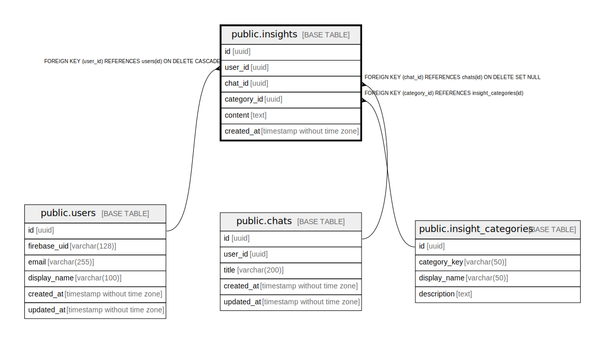

# public.insights

## Description

## Columns

| Name | Type | Default | Nullable | Children | Parents | Comment |
| ---- | ---- | ------- | -------- | -------- | ------- | ------- |
| id | uuid | gen_random_uuid() | false |  |  |  |
| user_id | uuid |  | false |  | [public.users](public.users.md) |  |
| chat_id | uuid |  | true |  | [public.chats](public.chats.md) |  |
| category_id | uuid |  | false |  | [public.insight_categories](public.insight_categories.md) |  |
| content | text |  | false |  |  |  |
| created_at | timestamp without time zone | now() | false |  |  |  |

## Constraints

| Name | Type | Definition |
| ---- | ---- | ---------- |
| insights_user_id_fkey | FOREIGN KEY | FOREIGN KEY (user_id) REFERENCES users(id) ON DELETE CASCADE |
| insights_chat_id_fkey | FOREIGN KEY | FOREIGN KEY (chat_id) REFERENCES chats(id) ON DELETE SET NULL |
| insights_category_id_fkey | FOREIGN KEY | FOREIGN KEY (category_id) REFERENCES insight_categories(id) |
| insights_pkey | PRIMARY KEY | PRIMARY KEY (id) |

## Indexes

| Name | Definition |
| ---- | ---------- |
| insights_pkey | CREATE UNIQUE INDEX insights_pkey ON public.insights USING btree (id) |
| idx_insights_user_id | CREATE INDEX idx_insights_user_id ON public.insights USING btree (user_id) |
| idx_insights_category_id | CREATE INDEX idx_insights_category_id ON public.insights USING btree (category_id) |

## Relations

---

> Generated by [tbls](https://github.com/k1LoW/tbls)
