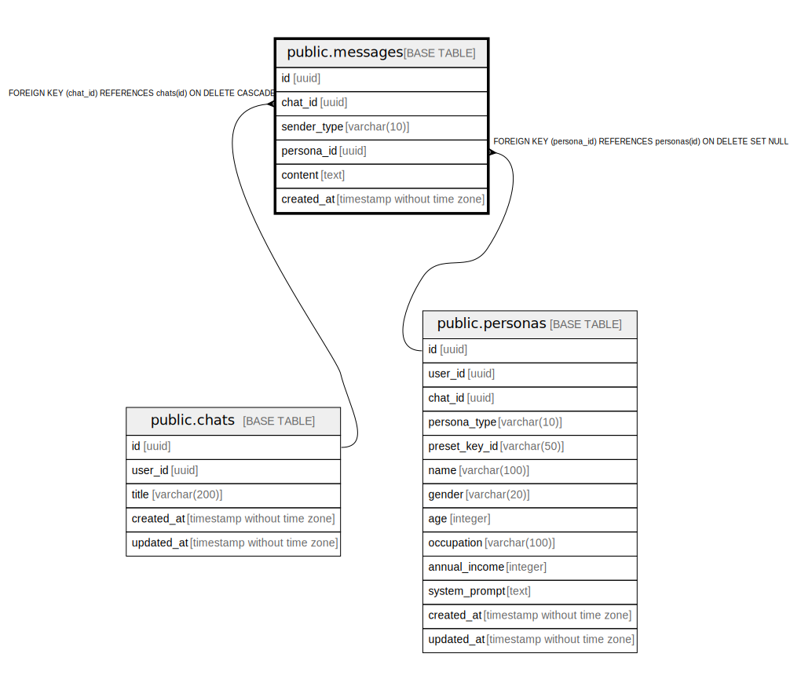

# public.messages

## Description

## Columns

| Name | Type | Default | Nullable | Children | Parents | Comment |
| ---- | ---- | ------- | -------- | -------- | ------- | ------- |
| id | uuid | gen_random_uuid() | false |  |  |  |
| chat_id | uuid |  | false |  | [public.chats](public.chats.md) |  |
| sender_type | varchar(10) |  | false |  |  |  |
| persona_id | uuid |  | true |  | [public.personas](public.personas.md) |  |
| content | text |  | false |  |  |  |
| created_at | timestamp without time zone | now() | false |  |  |  |

## Constraints

| Name | Type | Definition |
| ---- | ---- | ---------- |
| check_persona_sender | CHECK | CHECK ((((sender_type)::text = 'user'::text) OR (persona_id IS NOT NULL))) |
| messages_sender_type_check | CHECK | CHECK (((sender_type)::text = ANY ((ARRAY['user'::character varying, 'persona'::character varying])::text[]))) |
| messages_persona_id_fkey | FOREIGN KEY | FOREIGN KEY (persona_id) REFERENCES personas(id) ON DELETE SET NULL |
| messages_chat_id_fkey | FOREIGN KEY | FOREIGN KEY (chat_id) REFERENCES chats(id) ON DELETE CASCADE |
| messages_pkey | PRIMARY KEY | PRIMARY KEY (id) |

## Indexes

| Name | Definition |
| ---- | ---------- |
| messages_pkey | CREATE UNIQUE INDEX messages_pkey ON public.messages USING btree (id) |
| idx_messages_chat_id | CREATE INDEX idx_messages_chat_id ON public.messages USING btree (chat_id) |
| idx_messages_created_at | CREATE INDEX idx_messages_created_at ON public.messages USING btree (chat_id, created_at) |

## Relations

---

> Generated by [tbls](https://github.com/k1LoW/tbls)
