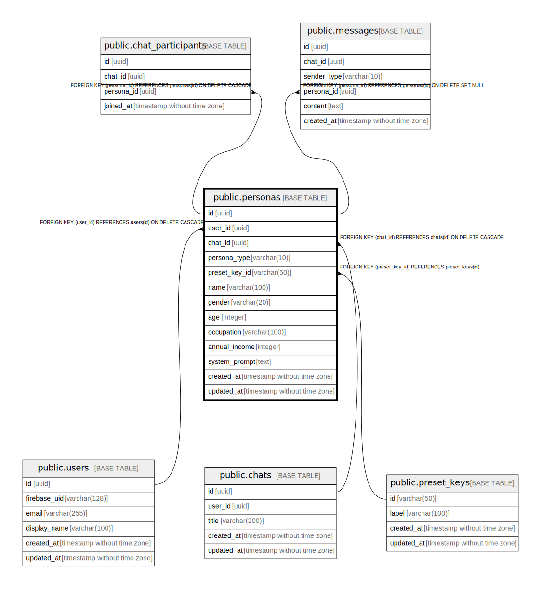

# public.personas

## Description

## Columns

| Name | Type | Default | Nullable | Children | Parents | Comment |
| ---- | ---- | ------- | -------- | -------- | ------- | ------- |
| id | uuid | gen_random_uuid() | false | [public.chat_participants](public.chat_participants.md) [public.messages](public.messages.md) |  |  |
| user_id | uuid |  | true |  | [public.users](public.users.md) |  |
| chat_id | uuid |  | true |  | [public.chats](public.chats.md) |  |
| persona_type | varchar(10) |  | false |  |  |  |
| preset_key_id | varchar(50) |  | true |  | [public.preset_keys](public.preset_keys.md) |  |
| name | varchar(100) |  | false |  |  |  |
| gender | varchar(20) |  | true |  |  |  |
| age | integer |  | true |  |  |  |
| occupation | varchar(100) |  | true |  |  |  |
| annual_income | integer |  | true |  |  |  |
| system_prompt | text |  | false |  |  |  |
| created_at | timestamp without time zone | now() | false |  |  |  |
| updated_at | timestamp without time zone | now() | false |  |  |  |

## Constraints

| Name | Type | Definition |
| ---- | ---- | ---------- |
| check_custom_has_user | CHECK | CHECK ((((persona_type)::text = 'preset'::text) OR (user_id IS NOT NULL))) |
| check_preset_has_key | CHECK | CHECK ((((persona_type)::text = 'custom'::text) OR (preset_key_id IS NOT NULL))) |
| personas_persona_type_check | CHECK | CHECK (((persona_type)::text = ANY ((ARRAY['custom'::character varying, 'preset'::character varying])::text[]))) |
| personas_user_id_fkey | FOREIGN KEY | FOREIGN KEY (user_id) REFERENCES users(id) ON DELETE CASCADE |
| personas_preset_key_id_fkey | FOREIGN KEY | FOREIGN KEY (preset_key_id) REFERENCES preset_keys(id) |
| personas_pkey | PRIMARY KEY | PRIMARY KEY (id) |
| fk_personas_chat | FOREIGN KEY | FOREIGN KEY (chat_id) REFERENCES chats(id) ON DELETE CASCADE |

## Indexes

| Name | Definition |
| ---- | ---------- |
| personas_pkey | CREATE UNIQUE INDEX personas_pkey ON public.personas USING btree (id) |

## Relations

---

> Generated by [tbls](https://github.com/k1LoW/tbls)
