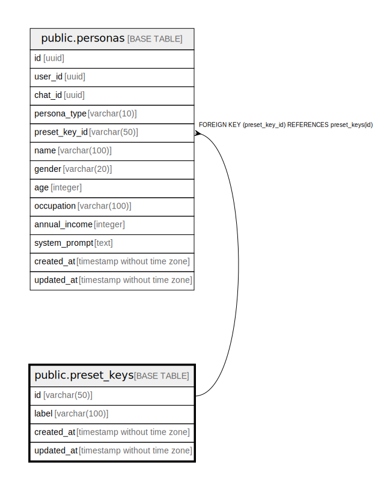

# public.preset_keys

## Description

## Columns

| Name | Type | Default | Nullable | Children | Parents | Comment |
| ---- | ---- | ------- | -------- | -------- | ------- | ------- |
| id | varchar(50) |  | false | [public.personas](public.personas.md) |  |  |
| label | varchar(100) |  | false |  |  |  |
| created_at | timestamp without time zone | now() | false |  |  |  |
| updated_at | timestamp without time zone | now() | false |  |  |  |

## Constraints

| Name | Type | Definition |
| ---- | ---- | ---------- |
| preset_keys_pkey | PRIMARY KEY | PRIMARY KEY (id) |

## Indexes

| Name | Definition |
| ---- | ---------- |
| preset_keys_pkey | CREATE UNIQUE INDEX preset_keys_pkey ON public.preset_keys USING btree (id) |

## Relations

---

> Generated by [tbls](https://github.com/k1LoW/tbls)
