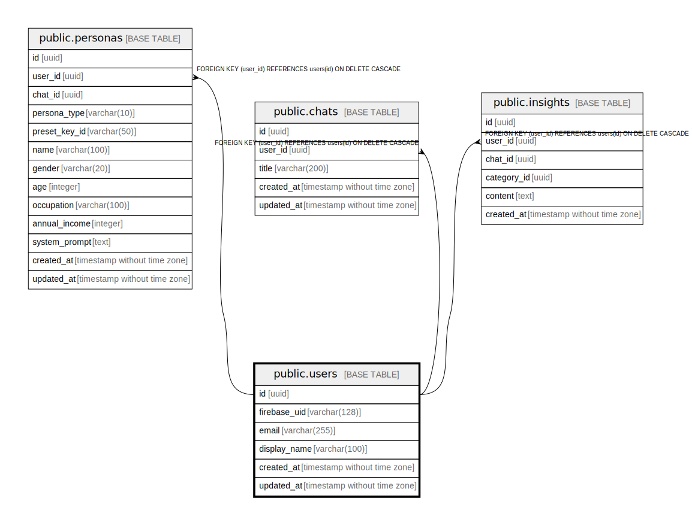

# public.users

## Description

## Columns

| Name | Type | Default | Nullable | Children | Parents | Comment |
| ---- | ---- | ------- | -------- | -------- | ------- | ------- |
| id | uuid | gen_random_uuid() | false | [public.personas](public.personas.md) [public.chats](public.chats.md) [public.insights](public.insights.md) |  |  |
| firebase_uid | varchar(128) |  | false |  |  |  |
| email | varchar(255) |  | true |  |  |  |
| display_name | varchar(100) |  | true |  |  |  |
| created_at | timestamp without time zone | now() | false |  |  |  |
| updated_at | timestamp without time zone | now() | false |  |  |  |

## Constraints

| Name | Type | Definition |
| ---- | ---- | ---------- |
| users_pkey | PRIMARY KEY | PRIMARY KEY (id) |
| users_firebase_uid_key | UNIQUE | UNIQUE (firebase_uid) |

## Indexes

| Name | Definition |
| ---- | ---------- |
| users_pkey | CREATE UNIQUE INDEX users_pkey ON public.users USING btree (id) |
| users_firebase_uid_key | CREATE UNIQUE INDEX users_firebase_uid_key ON public.users USING btree (firebase_uid) |

## Relations

---

> Generated by [tbls](https://github.com/k1LoW/tbls)
