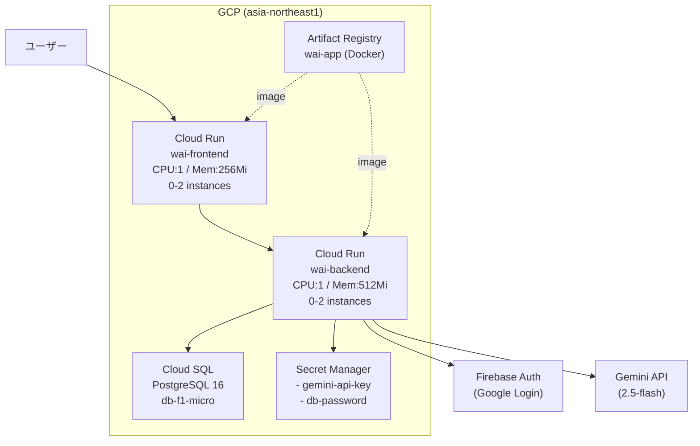

# インフラ構成図

## 概要

GCP 上にフルマネージド構成でデプロイ。Terraform で IaC 管理。

**リージョン**: asia-northeast1（東京）

## 構成図



## GCP サービス詳細

### Cloud Run

| 項目 | バックエンド | フロントエンド |
|------|------------|--------------|
| サービス名 | wai-backend | wai-frontend |
| ポート | 8080 | 8080 |
| CPU | 1 | 1 |
| メモリ | 512Mi | 256Mi |
| 最小インスタンス | 0 | 0 |
| 最大インスタンス | 2 | 2 |
| パブリックアクセス | 有効 | 有効 |

### Cloud SQL

| 項目 | 値 |
|------|-----|
| エンジン | PostgreSQL 16 |
| インスタンス名 | wai-postgres |
| マシンタイプ | db-f1-micro |
| データベース名 | wai |
| ユーザー | wai-app |

### Secret Manager

| シークレット | 用途 |
|-------------|------|
| wai-gemini-api-key | Gemini API キー |
| wai-db-password | DB パスワード |

### IAM

Cloud Run サービスアカウント (`wai-cloudrun-sa`) の権限:

- `roles/cloudsql.client` — Cloud SQL 接続
- `roles/secretmanager.secretAccessor` — シークレット読み取り

## Terraform の使い方

```bash
cd infra

# 変数ファイルを作成
cp terraform.tfvars.example terraform.tfvars
# terraform.tfvars を編集

# 初期化
terraform init

# 差分確認
terraform plan

# 適用
terraform apply
```

### terraform.tfvars に必要な変数

```hcl
project_id            = "your-gcp-project-id"
region                = "asia-northeast1"
gemini_api_key        = "your-gemini-api-key"
firebase_project_id   = "your-firebase-project-id"
firebase_api_key      = "your-firebase-api-key"
firebase_auth_domain  = "your-project.firebaseapp.com"
allowed_email_domains = ""
db_password           = "your-db-password"
```
